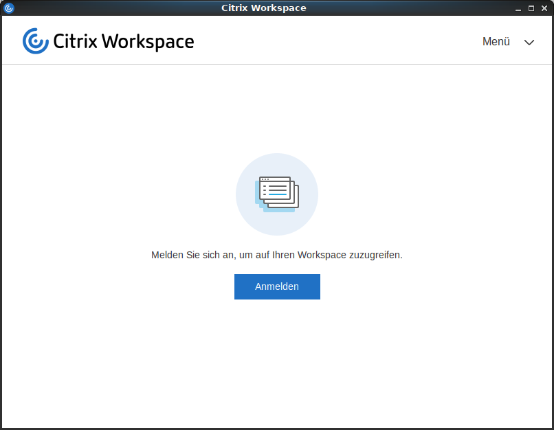
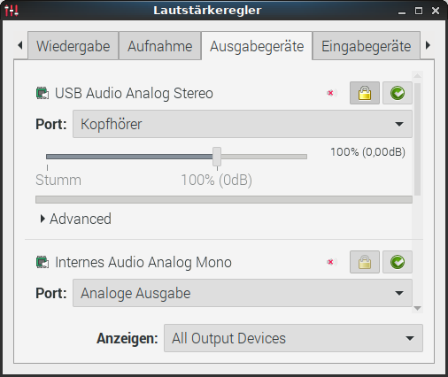
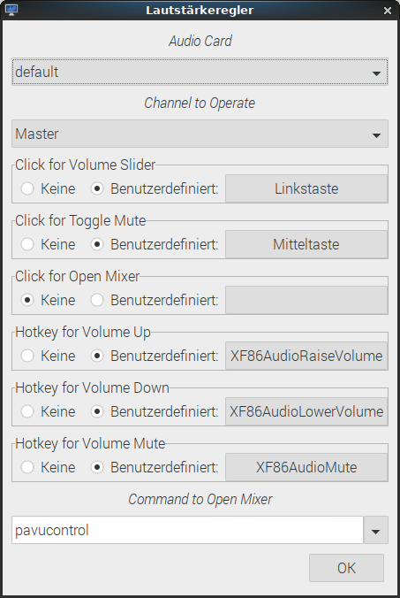
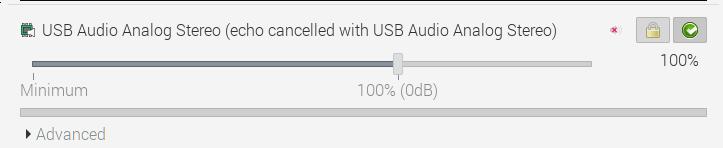
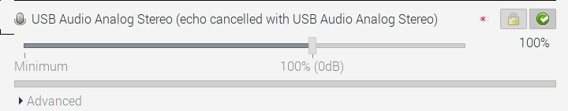
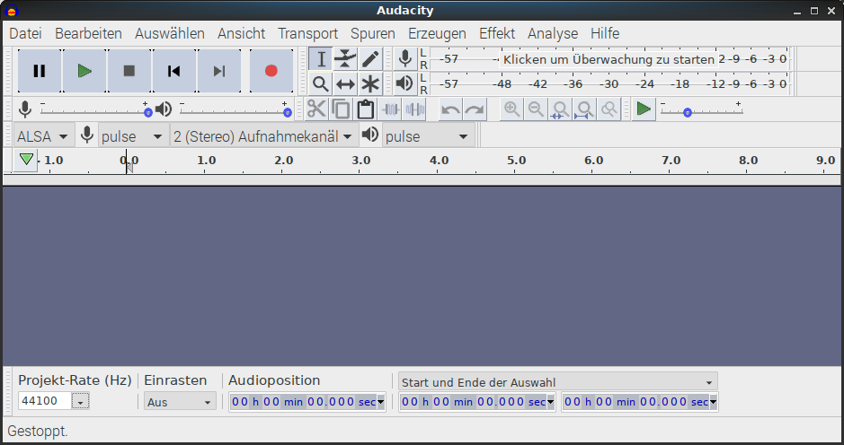
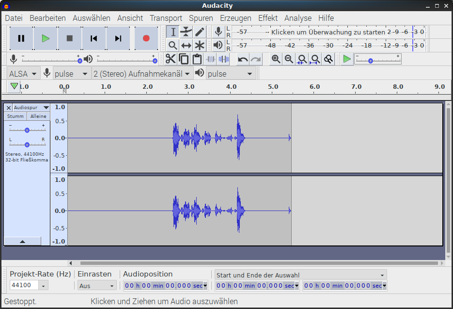

<!-- Required extensions: pymdownx.betterem, pymdownx.tilde, pymdownx.emoji, pymdownx.tasklist, pymdownx.superfences -->

# Home Office via Citrix Workspace App on Raspian Buster

The Raspberry Pi 4 single board computer supports dual screen configurations and
thus has become a silent, serious candidate for Home Office work.

I am using a Raspberry Pi 4 4GB, with Raspian Buster, 2x screen with an USB speakerphone.
The assumption is that Raspian is installed with the LXDE-pi desktop and that the displays are working. 

## What you will find in this HowTo
* Configuration of Raspian to be able to use a dual screen setup with the Citrix Workspace App.
* Setup echo cancellation with Pulseaudio to be able to make Teams / Skype4Business via Citrix Workspace.

Ths HowTo uses nano as text editor. So whereever you see nano you can use a different editor.

### Positives and Negatives
* The Citrix Workspace App  
  :heavy_plus_sign: can be downloaded as armhf Debian package for Buster on the Citrix website  
  :heavy_plus_sign: comes with it's own outdated certificate store, that most likely requires an update  
  :heavy_plus_sign: the memory usage is low enough that even the 1GB model should suffice  
  :heavy_minus_sign: requires a different window manager than openbox due to missing multi-monitor hints  
  :heavy_minus_sign: no optimization for realtime audio (Skype calls, etc.)  
* Raspian Desktop  
  :heavy_plus_sign: the LXDE-pi desktop is sleek and nicely customized  
  :heavy_minus_sign: the lightweight LXDE desktop does fullfill all assumptions expected by "business" apps  
  :heavy_minus_sign: I could not get a Bluetooth headset to work on Raspian, if the headset had the handsfree profile, the microphone could not be used and if the microphone got detected (a different device), the audioquality was really bad and the recording unstable.  
  :heavy_minus_sign: from my personal experience the Alsa soundsystem is not nearly as usable as Pulseaudio for an enduser  
  :heavy_minus_sign: Raspian Desktop starts to slow down after a few hours of use and the Xorg process shows almost 100% CPU.
  Logging out and in again workarounds this problem.  
  I discoverd that this does not happen if gpu_mem is bumped to 320MB and 4k60Hz mode is activated
  in /boot/config.txt:
  ```ini
  hdmi_enable_4kp60=1
  gpu_mem=320
  ```


## Citrix Workspace App Installation
The Citrix Workspace App can be downloaded via the Citrix homepage.

[Citrix Workspace app for Linux (ARM HF)](https://www.citrix.com/downloads/workspace-app/linux/workspace-app-for-linux-latest.html)

Navigate to _Available Downloads_ :arrow_forward: _Debian Packages_ :arrow_forward: _Full Packages_ and click **Download file**

Since version Dec 12, 2019 the package can be directly installed via gdebi package manager. All required packages will automatically be downloaded.
To install open the _Downloads_ folder in the file manager, right-click on the icaclient*.deb package and install the package.

You now can launch Citrix Workspace via _Menu_ :arrow_forward: _Internet_ :arrow_forward: _Citrix Workspace_

### SSL Connection Problems
Should you be unable to connect, and get a `SSL connection could not be established` error then it is highly likely that this is due
to missing certificate autority (ca) certificates delivered with the Citrix Workspace App.
In order to make Citrix Workspace use the ca cert's of Raspian:
```sh
sudo ln -s /etc/ssl/certs/*.pem /opt/Citrix/ICAClient/keystore/cacerts/
```
Now you should be able to connect.

### Notable User Settings in wfclient.ini
In the user settings folder of the Citrix Workspace App (former ICAClient) is wfclient.ini where several adjustments can be made.  
[Citrix Workspace App for Linux Product Documentation](https://docs.citrix.com/en-us/citrix-workspace-app-for-linux/configure-xenapp.html)  
[Citrix Workspace App for Linux OEM Reference Guide](https://developer-docs.citrix.com/projects/workspace-app-for-linux-oem-guide/en/latest/reference-information/)

To edit
```sh
cd ~/.ICAClient
nano wfclient.ini
```

#### Force a switch of the Keyboard Layout
I had to change `KeyboardLayout=(User Profile)` to `KeyboardLayout=German` to get a german keyboard layout, the automatic detection did not work on Raspian, maybe there is a smarter way.

[Some keys not woring with X inside Citrix client](https://discussions.citrix.com/topic/347214-some-keys-not-working-with-x-inside-citrix-client/?do=findComment&comment=1831151)

#### Set medium audio quality
I found that for using online meetings via Skype4Business tunneled through the SSL connection setting medium audio quality works best for me.
To set medium audio quality on the client add a line with `AudioBandwithLimit=1` to the `[WFClient]` section.


## Dual-Screen Fullscreen
Citrix Workspace supports fullscreen over dual screens layouts and so does the Raspberry Pi. Unfortunately the default window manager _Openbox_ lacks the correct hints for the Citrix Workpace App. The only way around it is to us a different windowmanager.  

[Citrix Workspace Linux App on Raspbian (Raspberry Pi 4 B with two Monitors) does not do Fullscreen over two monitors](https://discussions.citrix.com/topic/405984-solved-citrix-workspace-linux-app-on-raspbian-raspberry-pi-4-b-with-two-monitors-does-not-do-fullscreen-over-two-monitors/?do=findComment&comment=2054524)

I didn't use the icwm window manager, but went for Marco, the window manager of the Mate desktop environment. So if you have installed Mate, instead of LXDE, everything is fine.
Marco does not require one gazillion of additional libraries, is still relatively light weight and can be configured via command line.

[Marco, MATE default window manager](https://github.com/mate-desktop/marco)

### Installation

Install the packages via apt
```sh
sudo apt install marco mate-themes
```

In order for mate to be used, the window manager of the LXDE-pi desktop has to be changed.

This can either be accomplished for all users or just for a single user by changing the window manger in `desktop.conf`.

For a global configuration, edit the file:
```sh
sudo nano /etc/xdg/lxsession/LXDE-pi/desktop.conf
```

For a configuration for the current user only, copy `desktop.conf` to your user directory and change the window manager.
```sh
cp /etc/xdg/lxsession/LXDE-pi/desktop.conf ~/.config/lxsession/LXDE-pi/
nano ~/.config/lxsession/LXDE-pi/desktop.conf
```

Change 
```
window_manager=openbox-lxde-pi
```
to
```
#window_manager=openbox-lxde-pi
window_manager=marco
```

If you log out of your X11 session an login again, the desktop will no longer use openbox as window manager, but marco instead.

### Configure marco
I configured marco to use a single workspace (the default is 4), the Blue-Submarine theme because it is a good fit for Raspian colors and sloppy window focus mode. Sloppy means that an open window will get the focus once you hover the mouse over it.
```sh
gsettings set org.mate.Marco.general num-workspaces 1
gsettings set org.mate.Marco.general theme Blue-Submarine
gsettings set org.mate.Marco.general focus-mode sloppy
```

Once you have done that Citrix Workspace will look like



## Speakerphone or Headset with Echo Cancellation via Pulseaudio

I was trying to use Skype4Business calls via Citrix Workspace App and a cheap USB Speakerphone, because I hate wearing headsets. My first experience was absymal.
I had to fiddle with the microphone volume and then there always was an echo effect where colleagues could here themselves or sounding like "Mr. Roboto".

As I was able to use the speakerphone without any echo effect in a local Microsoft Teams session on both a PC and a Mac, I suppose that Teams does echo cancellation all by itself if it is running locally. I also suppose that this is the case for it's predecessor Skype4Business. I guess that it does not work over Citrix Workspace App on armhf, because there is no optimized "realtime" Citrix HDX audio available over a TLS connection.

Luckily there is Linux the tinker-os. You can install, compile or configure almost anything, although you may rip your hair out on the voyage to achieve the goal.
The goal in this case is to do not rely on Skype4Business to do echo cancellation, but to use a locally running software, so that the cheap speakerphone will behave like an expensive speakerphone and performs acoustic echo cancellation.

The software that can do that on Raspian is the pulseaudio daemon with it's module-echo-cancel.

### Installation

First you need to install pulseaudio and it's graphical mixer application pavucontrol:

```sh
sudo apt install pulseaudio pavucontrol
```

### Switching from Alsa to Pulseaudio
Raspian buster is using the Alsa soundsystem for audio an not Pulseaudio as it did in Raspian stretch. In my personal experience Alsa is not as user friendly, it lacks some features of Pulseaudio and is more complicated to configure.

Alsa can be configured to use Pulseaudio for input / output and mixer control.
To do that make a backup copy of your `~/.asoundrc` and set pulse as default audio device and mixer.

```sh
cd ~
mv .asoundrc .asoundrc.orig
nano .asoundrc
```

Add the lines in the editor.
```ini
pcm.default pulse
ctl.default pulse
```

Raspian uses the volume control in the panel to configure alsa, so it is best to remove it from the panel to prevent an accidential use and destruction of `.asoundrc`.

To remove the Volume Control (Alsa/BT) from the panel right-click on the icon

and select "remove volume control from the panel".

After that, log out of your X11 session or reboot. The pulseaudio daemon will be started when you log in into your X11 session.

To test if there is audio via pulseaudio, open the Pulseaudio Mixer, where you should have an output and an input audio device.



Now you can add back a different Volume control applet to the pandel, by right clicking on an empty space in the panel and selecting Add/remove panel enties.
Choose Add and select _Volume Control_ - not _Volume Control (Alsa/BT)_.

After adding the Volume Control to the panel you can configure it's settings:



The important part is to select "pavucontol" as Command to Open Mixer.

Now any app, for example when Chromium is playing audio, should be using Pulseaudio.

Finally it is time to configure acoustic echo cancellation in `/etc/pulse/default.pa`

### Configuring Acoustic Echo Cancellation

I forcefully enabled echo cancellation and set the device with echo cancellation to be used as default microphone and default speaker. For acoustic echo cancellation to work the output audio signal from the speaker that is received by the microphone is removed before sending it to the application.

General documentation about this module can be found at the Pulseaudio documentation: [module-echo-cancel](https://www.freedesktop.org/wiki/Software/PulseAudio/Documentation/User/Modules/#module-echo-cancel)


```sh
sudo nano /etc/pulse/default.pa
```

Here is what worked best for me with the omnidirectional microphone in the speakerphone. It uses the webrtc method developed by Google, turns off analog gain control (moving the volume slider) and turns on digital gain control (audio gain controlled via signal processing) and enables the extended filter, because the standard filter was not good enough without reducing the signal sampling rate of the microphone and speaker. With the setting below I can listen to music and perform conference calls via the speakerphone without too many audio distortions.

In this file add at the end:

```ini
load-module module-echo-cancel source_name=noechosource sink_name=noechosink aec_method=webrtc aec_args="analog_gain_control=0 digital_gain_control=1 extended_filter=1"
set-default-source noechosource
set-default-sink noechosink
```


#### Alternative Setting: Low quality mono audio
I found another combination, that did work out ok'ish for audio calls with the effect that the audio is muffled. You can forget to listen to music with this setting, it will sound like you listen to music on the other end of a transatlantic call at the beginning of the 90's. It could be best if you are on a slow connection.

These settings are from here: [Using PulseAudio: module echo cancel](https://github.com/alfredh/baresip/wiki/Using-PulseAudio:-module-echo-cancel)
```ini
load-module module-echo-cancel source_name=noechosource sink_name=noechosink aec_method=webrtc rate=8000 channels=1
set-default-source noechosource
set-default-sink noechosink
```

#### Alternative Setting: Beamforming with directional microphones
If you have a device with multiple directional microphones, for example a webcam, the beamforming method may work best for acoustic echo cancellation. For details see the module-echo-cancel documentation. Here is the example from it, which I couldn't test.
> If you have a webcam with 2 microphones 8cm apart, and you want to point it forwards, you could use

```ini
load-module module-echo-cancel source_name=noechosource sink_name=noechosink aec_method=webrtc aec_args="analog_gain_control=0 digital_gain_control=1 beamforming=1 mic_geometry=-0.04,0,0,0.04,0,0"
set-default-source noechosource
set-default-sink noechosink
```

### Testing Acoustic Echo Cancellation

After you have changed the Pulseaudio configuration, you need to reload the pulseaudio daemon in your user session.

```sh
pulseaudio -k
```

If you re-open pavucontrol, you should now see one output and one input device that has echo cancellation enabled. Because this device has been set as default all audio will be played through the output device and all recordings happen through the input device with echo cancellation.




In order to the setup you need a program that plays audio and an audio recording software. For playing audio, I can recommend to play a Youtube Covid talk show via Chromium, because the spoken audio is very similar to an online meeting.  
For recording, I'd recommend Audacity, which needs to be installed first.

```sh
sudo apt install audacity
```

You can now start it from the menu.



The real test:

1. Start Chromium and play a talk show
2. Press the record button and start talking, after that press the stop button  
   
   If everything went well, there should be no signal for all that was played through the speaker and a waveform when you were talking. 
3. To check, press the play button in Audacity

Ideally, everything played through the speaker should be completely gone, but echo cancellation is not perfect. Thus you may want to experiment with the module-echo-cancel settings until you find a setup that works for you.
